<style>
  /* Custom Dark Mode Theme for Markdown Preview */
  body {
    background-color: #0d1117 !important;
    color: #c9d1d9 !important;
    font-family: -apple-system, BlinkMacSystemFont, "Segoe UI", Helvetica, Arial, sans-serif, "Apple Color Emoji", "Segoe UI Emoji" !important;
  }
  a {
    color: #58a6ff !important;
  }
  blockquote {
    color: #8b949e !important;
    border-left: 0.25em solid #30363d !important;
    background-color: #161b22 !important;
    padding: 0 1em !important;
  }
  /* Inline code styling only */
  :not(pre) > code {
    background-color: rgba(110, 118, 129, 0.4) !important;
    color: #e6edf3 !important;
    border-radius: 6px !important;
    padding: 0.2em 0.4em !important;
  }
  /* Block code container styling */
  pre {
    background-color: #161b22 !important;
    border: 1px solid #30363d !important;
    border-radius: 6px !important;
    padding: 16px !important;
    overflow: auto !important;
  }
  /* Ensure syntax highlighter colors are not overridden by a generic code color */
  pre code {
    background-color: transparent !important;
    color: inherit !important;
    padding: 0 !important;
    border-radius: 0 !important;
  }
  h1, h2, h3, h4, h5, h6 {
    border-bottom-color: #30363d !important;
    color: #f0f6fc !important;
  }
  hr {
    background-color: #30363d !important;
    height: 1px !important;
    border: none !important;
  }
</style>

# Engineering Devlog: Pine A64 Gaming PC

Welcome to the engineering devlog for the Pine A64 Gaming PC project. This document serves as the repository for progress logs, design choices, component testing, and build records as we transform the Pine A64 single-board computer into a custom-cooled, custom-enclosed gaming PC.

Here is the spreadsheet which organizes the entire project: https://docs.google.com/spreadsheets/d/1We2MmTOR3fEgsacE6zURNgYWdwFos29sACSzlIPlyxY/edit?usp=sharing

## Hour 1: Project Teardown & Component Sourcing

* **Date:** June 22, 2026

### Activity Summary
Removed the pre-existing stock acrylic enclosure from the Pine A64 to expose the bare board. Finalized the engineered Bill of Materials (BOM) for the 12V active cooling system and ordered the MT3608 boost converter, copper heatsinks, and wiring hardware.

### Engineering Notes
> [!NOTE]
> The original acrylic mounting hardware was kept and carefully stored. The thread pitches will be cross-referenced with planned M3 heat-set inserts to ensure compatibility during the custom enclosure design.

### Media & Sourcing Logs

#### 1. Bare-Board Teardown
Exposed Pine A64 board (Rev B, 2016-03-21) ready for thermal measurements and custom mount planning:
<div align="center">
  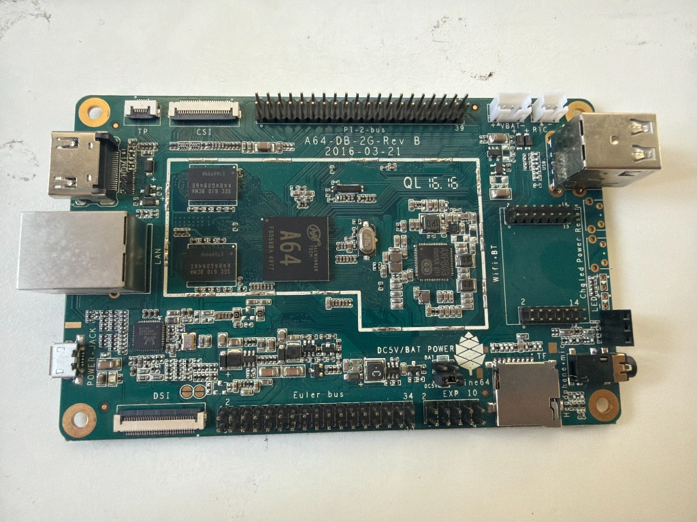
</div>

#### 2. Active Cooling Fan
A Noctua NF-A6x25 FLX 12V DC (0.96W, 0.08A) fan will be integrated to provide high-static-pressure, low-noise active cooling:
<div align="center">
  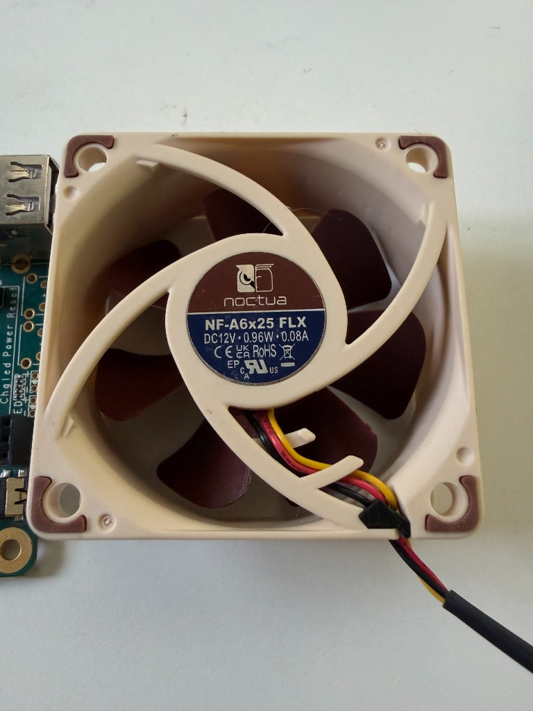
</div>

#### 3. Sourced Bill of Materials (BOM)
Order placed for essential power management, thermal, and prototyping hardware:
<div align="center">
  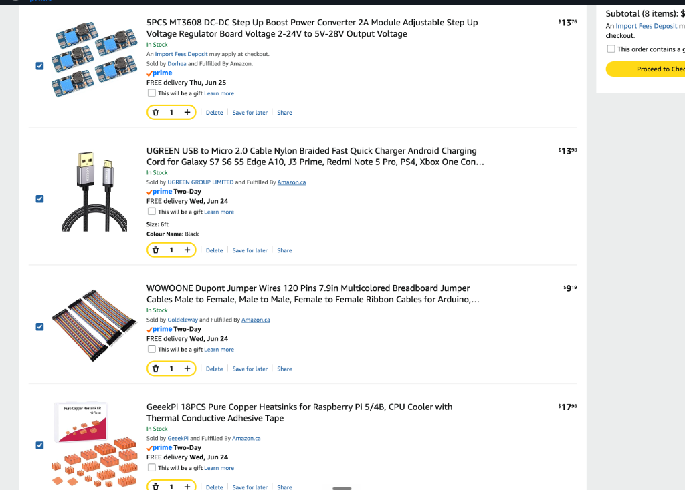
</div>

## Hour 2: Documentation Review & Pinout Architecture Analysis

* **Date:** June 22, 2026

### Activity Summary
Researched the Pine A64 hardware by watching unboxing tutorials and reviewing the official PINE64 documentation. Mapped out the exact pins needed for the custom cooling fan and the external power button.

### Engineering Notes
* **Pi-2 Bus (40-pin header):** Found the power pins for the cooling system. Pins 2 and 4 provide 5V power, and Pin 6 is Ground (GND). These will connect to the MT3608 boost converter.
* **Euler Bus (34-pin header):** Found the hardware power switch pins. Pin 27 (PB2) and Pin 34 (GND) will connect to the external momentary tactile button.

### Reference Links
* [PINE_A64 Wiki](https://wiki.pine64.org/wiki/PINE_A64)
* [Pine A64 Schematic & Pin Assignment PDF](https://files.pine64.org/doc/Pine%20A64%20Schematic/Pine%20A64%20Pin%20Assignment%20160119.pdf)
* [PINE64 official Schematics & Certifications Documentation](https://pine64.org/documentation/Pine_A64/Further_information/Schematics_and_certifications/)
* [Pine A64 Tutorial/Unboxing Reference 1](https://www.youtube.com/watch?v=4FUbQ5n3BIg)
* [Pine A64 Tutorial/Unboxing Reference 2](https://www.youtube.com/watch?v=FxGeloh80RQ)

## Hour 3: OS Selection, Flashing, & Initial Boot Diagnostics

* **Date:** June 24, 2026

### Activity Summary
Selected DietPi as the core operating system to minimize background processing and maximize network stability for PC game streaming (Moonlight). Flashed the OS image using BalenaEtcher. Initiated the first boot sequence but encountered immediate HDMI display failures and random system halts.

### Engineering Notes
* **Initial Boot Failures (Black Screen):** Diagnosed as potential voltage sags (brownouts) caused by peripheral power spikes.
* **USB Hotplug Brownouts:** Investigated by cold-plugging a keyboard before applying power to bypass capacitor draw spikes.
* **HDMI Handshake Failure:** Realized the HDMI handshake was failing due to resolution mismatches, requiring a pivot to a headless (SSH) configuration approach.

## Hour 4: Network Diagnostics, Subnet Sweeping, & Hardware Isolation

* **Date:** June 24, 2026

### Activity Summary
Attempted to establish a headless SSH connection to bypass the broken HDMI output. Upgraded the power delivery system to an Anker GaNPrime 100W brick to rule out amperage deficits. Performed advanced subnet sweeping to track down the board's IP address. Concluded with a bare-board isolation test.

### Engineering Notes
* **Network Topology Issue:** Discovered the local OpenWrt router overrides the default `.local` mDNS protocol in favor of `.lan`. Wrote a custom bash loop to brute-force map the subnet:
  ```text
  for ip in {1..254}; do ping -c 1 -W 50 192.168.1.$ip &> /dev/null & done; sleep 2; arp -a
  ```
* **MAC Address Analysis:** Successfully identified the board's dynamic IP (`192.168.1.250`) by analyzing the locally administered MAC address (`2:ba:3e:cd:49:25`) generated by DietPi.
* **Isolation Test & Power Delivery:** Despite the Anker 100W GaN upgrade, continuous pings showed 100% packet loss, indicating a recurring physical crash. Conducted a "Bare Board Isolation Test" (power only, no SD card). This proved that either the Micro-USB cable's electrical resistance is too high, or the MicroSD card itself is spiking power draw / physically corrupted, preventing the bootloader from executing.

## Hour 5: The Performance Bottleneck & Root Cause Analysis

* **Date:** June 26, 2026

### Activity Summary
Initially, the Moonlight stream was completely unplayable, hovering around 2 frames per second.

* **The Problem:** The stream was relying on "software decoding." This means the Pine A64's general CPU was trying to mathematically calculate every pixel of the video stream. For a 60 FPS stream, the CPU simply couldn't keep up.
* **The Root Cause:** In a previous session, to prevent my 1440p monitor from crashing the system, the OS was forced onto a basic display driver called `fbdev` (framebuffer). While this made the desktop stable, `fbdev` is essentially a "dumb" canvas. It physically blocked Moonlight from accessing the Pine A64's built-in Hardware Video Decoder (the CedarX VPU), forcing the system to fall back on the CPU.

## Hour 6: Unlocking Hardware Acceleration via Kernel Modification

* **Date:** June 26, 2026

### Activity Summary
To get 60 FPS, I needed to re-enable the modern DRM (Direct Rendering Manager) display driver so the hardware decoder could function. However, I had to prevent the 1440p monitor from crashing the system's limited memory pool (CMA).

* **The Solution:** Instead of fixing this in the operating system, I went a level deeper into the Linux kernel bootloader. I modified `/boot/dietpiEnv.txt` to inject a strict resolution limit: `video=HDMI-A-1:1920x1080@60`.
* **Details:** By forcing the display to negotiate at 1080p before the OS even loaded, the display driver required significantly less memory. This left enough room in the shared memory pool for the hardware video decoder to turn on. I then deleted the legacy `fbdev` configuration, allowing the hardware-accelerated pipeline to take over.

## Hour 7: The Embedded Transition (Killing the Desktop)

* **Date:** June 26, 2026

### Activity Summary
Even with hardware decoding enabled, running a full graphical desktop environment (XFCE) in the background consumes valuable memory and adds input latency. To make this a true "appliance," I decided to run Moonlight on the bare metal, without a desktop.

* **The Challenge:** DietPi (the operating system) actively fought this change. Even after using system commands to disable the display manager (`systemctl mask lightdm`), the OS would still boot into a graphical desktop.
* **Investigation:** After digging into the OS architecture, I discovered DietPi uses hidden startup scripts (`/boot/dietpi/dietpi-login`) that forcefully launch the X11 server on boot.
* **The Solution:** I took the nuclear option. I completely uninstalled the XFCE desktop environment and all graphical components (`apt purge xfce4*`). If the desktop physically didn't exist on the drive, the background scripts couldn't launch it.

## Hour 8: Rebuilding the Graphics Pipeline (EGLFS & KMS)

* **Date:** June 26, 2026

### Activity Summary
With the desktop gone, the system successfully booted to a raw text terminal. However, launching Moonlight now caused two new issues:
1. There was no mouse cursor.
2. The stream crashed immediately upon launching, throwing SDL2 display errors.

* **The Cause:** Moonlight usually relies on the desktop environment to draw the cursor and manage video windows. Without a desktop, it didn't know how to talk to the screen.
* **The Solution:** I configured Moonlight to operate in an embedded mode using EGLFS (Embedded Graphics Library Framebuffer System). I injected specific environment variables into the root user's `.bashrc` profile:
  * `QT_QPA_PLATFORM=eglfs`: Tells the UI to draw directly to the screen without needing a window manager.
  * `SDL_VIDEODRIVER=kmsdrm`: Tells the video stream to route directly to the Kernel Mode Setting hardware layer.
  * `QT_QPA_EGLFS_HIDECURSOR=0`: Forces the software to draw a mouse cursor manually.

## Hour 9: Overcoming Hardware Initialization Races

* **Date:** June 26, 2026

### Activity Summary
The final hurdle occurred during the automated boot process. When the system booted, it threw a wall of text errors: `Failed to load EGL device integration "kms"` and `Failed to initialize KMS`.

* **The Cause (Race Condition & Permissions):** Because the system was booting so fast, the custom script was trying to launch Moonlight before the Linux kernel had finished waking up the GPU and HDMI ports. Furthermore, the terminal user didn't have the correct security permissions to access the bare-metal graphics hardware.
* **The Final Fixes:**
  * **Timing Delay:** I added a simple `sleep 3` command to the boot script. This gave the hardware drivers exactly 3 seconds to fully initialize before Moonlight asked for access.
  * **Hardware Permissions:** I wrote a custom udev rule (`99-kms.rules`) that permanently grants open read/write access (`MODE="0666"`) to the GPU nodes (`/dev/dri/card0` and `/dev/dri/renderD128`).
  * **Cleanup:** I moved the broken DietPi login scripts to backup files to clear terminal errors and fixed minor syntax formatting in the bash profile.

## Hour 10: Input/Output Diagnostic Sweep & System Boot Order Analysis

* **Date:** June 26, 2026

### Initial State Observed
* **Boot Environment:** Device boots into a minimal terminal (DietPi CLI environment) with Moonlight configured to launch automatically.
* **Input Issues:** Mouse input is not functional or behaves inconsistently.
* **Boot Errors:** Early boot errors referencing missing login scripts: `/boot/dietpi/dietpi-login: No such file or directory`.

### Diagnostics Performed
* **Input Subsystem Inspection:** Verified `/proc/bus/input/devices` and confirmed multiple valid HID devices (including the wireless keyboard/mouse receiver). Event nodes were correctly created (`/dev/input/event*`), and the mouse device was detected and producing events via `evtest`.
  * *Conclusion:* Hardware input is fully functional at the kernel level.
* **System Service State Review:** Running `systemctl list-unit-files` showed multiple masked services, and mixed enabled/disabled network and display services, but no dedicated Moonlight systemd service.
  * *Conclusion:* The startup flow is currently shell-based rather than service-based.
* **GPU / Display Stack Inspection:** Confirmed `sun4i-drm` display engine is initialized and DRM is active. The GPU driver is loaded (`lima 1.1.0`) with a framebuffer active at the HDMI output.
  * *Conclusion:* The display stack is functional, but constrained by the low-end GPU.
* **Boot Script Investigation:** Examined `/boot/boot.cmd` (standard U-Boot chain is intact, no Moonlight integration at firmware level) and reviewed `/boot/dietpiEnv.txt` (minimal overlays, no GPU tuning applied).
  * *Conclusion:* No early boot acceleration or optimization layers are present.

### Key Issue Identified
Moonlight was being launched too early in the shell environment. Input devices and the DRM stack were not fully initialized at execution time, and the EGLFS rendering path was causing instability.

## Hour 11: Startup Logic Optimization & Render Backend Performance Tuning

* **Date:** June 26, 2026

### Goal
Stabilize Moonlight startup and improve rendering performance.

### Major Interventions
1. **Bash Startup Cleanup:** Investigated `/root/.bashrc` and found the Moonlight auto-exec logic embedded with a waiting loop on `/dev/input/event9` followed by `exec moonlight-qt`.
   * *Problem:* A race condition exists on input device readiness, with no guarantee the DRM or GPU stack is initialized.
2. **Environment Variable Adjustments:** Tested multiple variables including:
   * Qt EGLFS mode: `QT_QPA_PLATFORM=eglfs` (caused cursor issues and rendering warnings)
   * SDL KMS mode: `SDL_VIDEODRIVER=kmsdrm` (proved more stable on this hardware)
   * Hardware decode flag: `MOONLIGHT_USE_HW_DECODER=1`
3. **Runtime Directory Fixes:** Detected that `XDG_RUNTIME_DIR` was invalid or not set. Created `/run/user/0` with correct permissions as a temporary fix, which reduced Qt runtime warnings and improved session consistency.
4. **Input Behavior Analysis:** Mouse input was confirmed functional via kernel event testing; the problem was isolated to rendering backend mismatch (EGLFS cursor handling limitations).
5. **Performance Diagnosis:** Identified a critical bottleneck: the Pine A64 GPU is a Mali-400 (`lima` driver) which lacks a strong hardware decode path for streaming. This results in CPU-bound H.264 decoding, causing severe frame drops (~2 FPS behavior observed) and cursor lag amplified by rendering stalls.
6. **Architectural Correction Proposed:** Transitioning from bash-based autostart and EGLFS control to a systemd-managed startup using the SDL/KMS rendering path and delayed initialization.

## Final State & Outcome Summary (After 11 Hours)

### System Status
* **Working:**
  * Moonlight launches automatically.
  * DRM display is functional.
  * Input devices are detected.
  * GPU driver is active.
* **Partially Broken / Unstable:**
  * EGLFS rendering instability.
  * Cursor artifacts and warnings.
  * Poor frame pacing.
  * High input latency.

### Root Causes Identified
1. Wrong rendering backend for hardware (EGLFS overloading the system).
2. CPU-bound video decode pipeline (Mali-400 driver constraints).
3. Shell-based startup causing race conditions.
4. Lack of systemd-controlled initialization order.

### Outcome Summary
This session successfully transitioned the system from a **"working but unstable shell-launched streaming prototype"** to a **"functionally correct but architecturally misaligned bare-metal streaming stack."**

## Hour 12: CAD Case Design & Reference Import

### Activity Summary
Began the Computer-Aided Design (CAD) phase for the custom PC case using Fusion 360. 

### Engineering Notes
* **Reference Geometry:** Researched existing case designs for the PINE A64. Found a relevant model on Printables ([model 301005](https://www.printables.com/model/301005-pine-a64-case)) and imported it into Fusion to analyze its dimensions and mounting strategy.
* **Component Integration:** Imported step files for the Noctua NF-A6x25 fan and the Cherry MX mechanical switch (for the power button) into the Fusion assembly to ensure accurate clearances and layout planning.

## Hour 13: Fan Mounting Integration

### Activity Summary
Designed the top section of the enclosure specifically focusing on the integration of the Noctua active cooling fan.

### Engineering Notes
* **Mounting Pillars:** Added four structural pillars with M3 screw holes to the internal chassis design. These are precisely spaced to align with the Noctua fan's mounting holes, ensuring a secure and vibration-free fit.

<div align="center">
  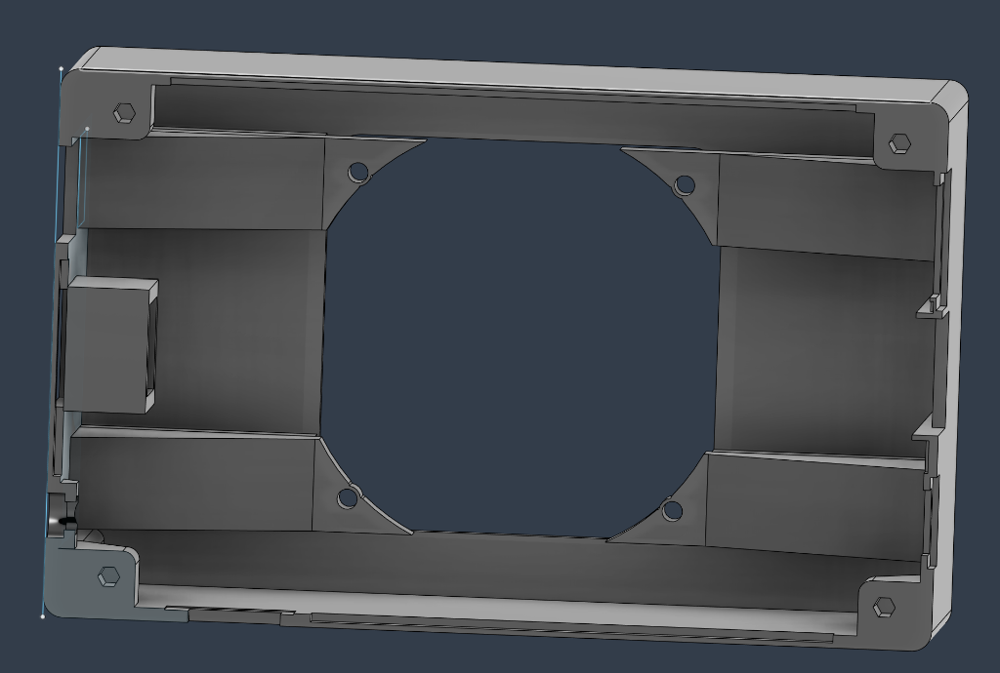
</div>

## Hour 14: Power Button Cutout Design

### Activity Summary
Engineered the mounting mechanism for the external Cherry MX power switch on the side panel of the case.

### Engineering Notes
* **Snap-Fit Mechanism:** Creating the cutout was mechanically tricky. It required extruding three distinct square profiles so the switch would snap perfectly into place. 
* **Tolerances:** Designed the bottom layer of the cutout to be precisely 1.5mm thick, providing the ideal flexibility and clearance for an easy, secure snap-fit installation.

<div align="center">
  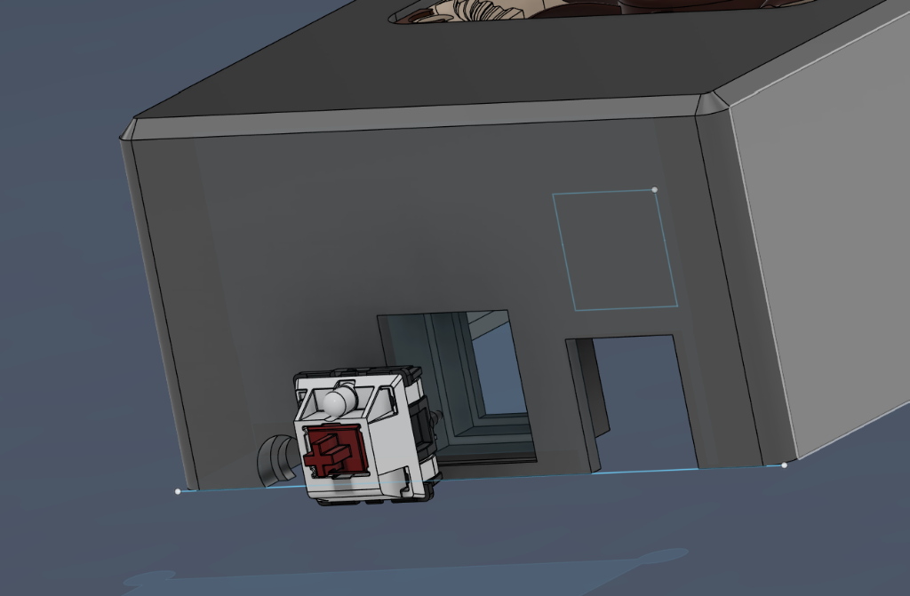
</div>

## Hour 15: Top Enclosure & Fan Cutout

### Activity Summary
Finalized the topmost section (the roof) of the case enclosure to enclose the components while providing necessary airflow.

### Engineering Notes
* **Enclosure Height:** Extruded the side walls 4mm upwards so they sit flush with the height of the installed Noctua fan.
* **Airflow Optimization:** Added the full top cover and created a precise fan cutout so only the fan blades and hub are exposed. Applied a chamfer to the cutout edges for a cleaner aesthetic and to potentially reduce air turbulence.

<div align="center">
  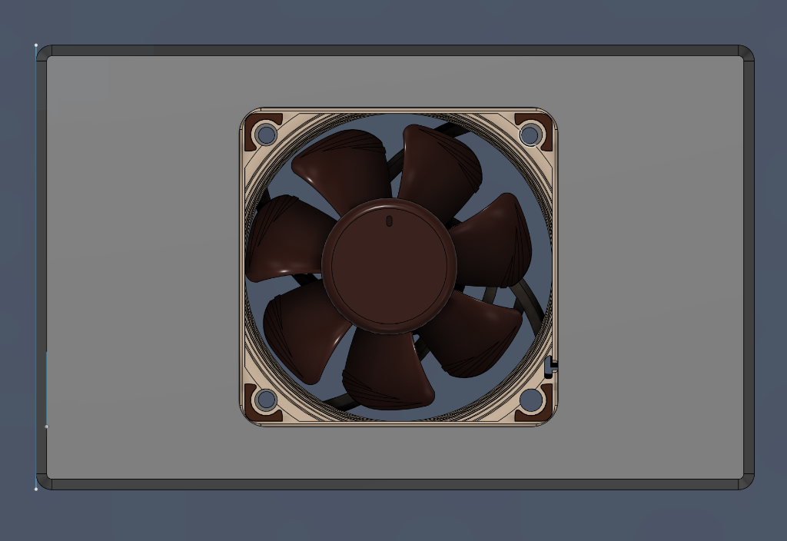
</div>

## Hour 16: 3D Printing Optimization & Revision

### Activity Summary
Optimized the Fusion 360 design for 3D printing, ran a test print, and performed a mechanical revision based on physical fitment testing.

### Engineering Notes
* **Print Optimization:** Spent the first part of the session eliminating structural gaps by adding solid extrusions to make the design more manifold and printer-friendly.
* **Mechanical Revision:** After printing the prototype, discovered a clearance issue—the fan could not physically slide into place because all four mounting pillars blocked its path. 
* **The Fix:** Removed one of the four mounting pillars in the CAD model. This modification provides enough clearance for the fan to slide in perfectly while still retaining sufficient structural support from the remaining three pillars.

<div align="center">
  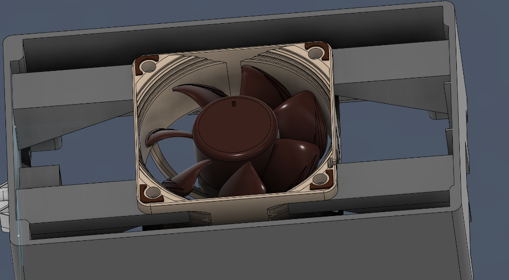
</div>

## Hour 17: Final Wiring Hardware & Pi-2 Bus Power Tap

* **Date:** June 30, 2026

### Activity Summary
Sourced and staged the final wiring hardware needed to permanently connect the Noctua fan and power button into the printed enclosure, then soldered the fan's power leads directly onto the Pi-2 bus 40-pin header identified back in Hour 2.

### Engineering Notes
* **Hardware Staged:** MT3608 boost converter modules, a UGREEN USB extension cable (routed out through the rear panel for SSH/power access without opening the case), and a 40-pin Dupont jumper wire set for breaking out the Euler bus power-button pins.
* **Fan Power Tap:** Soldered the fan's red (+) lead to Pin 2 (5V) and the black (–) lead to Pin 6 (GND) on the Pi-2 bus header, matching the pinout mapped in Hour 2. Leads run from the header directly into the MT3608 input side before stepping up to the fan.

<div align="center">
  
</div>

<div align="center">
  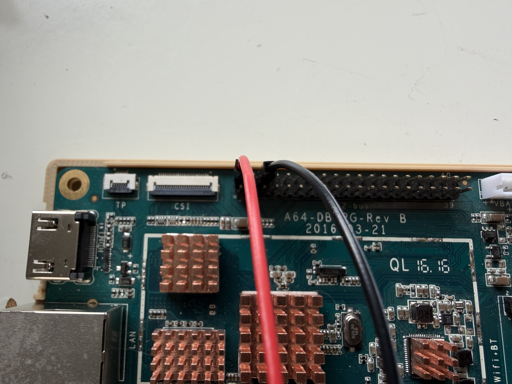
</div>

## Hour 18: Power Button Assembly & Euler Bus Wiring

* **Date:** June 30, 2026

### Activity Summary
Built out the external power button as its own sub-assembly before wiring it into the board, then connected it to the Euler bus header pins mapped during the Hour 2 pinout analysis.

### Engineering Notes
* **Switch Prep:** Mounted the Cherry MX switch in a printed jig and soldered its two leads (yellow signal, red-brown ground) directly to the switch terminals, keeping the joints small enough to still snap into the Hour 14 side-panel cutout.
* **Board Connection:** Routed those same leads to Pin 27 (PB2) and Pin 34 (GND) on the Euler bus, adjacent to the board's `DC5V/BAT POWER` silkscreen. A short pigtail runs from the header, alongside the audio jack, out to the switch in the side panel.
* **Strain Relief:** Hot glue was applied over the header connection to prevent the fine-gauge leads from working loose during case assembly/disassembly.

<div align="center">
  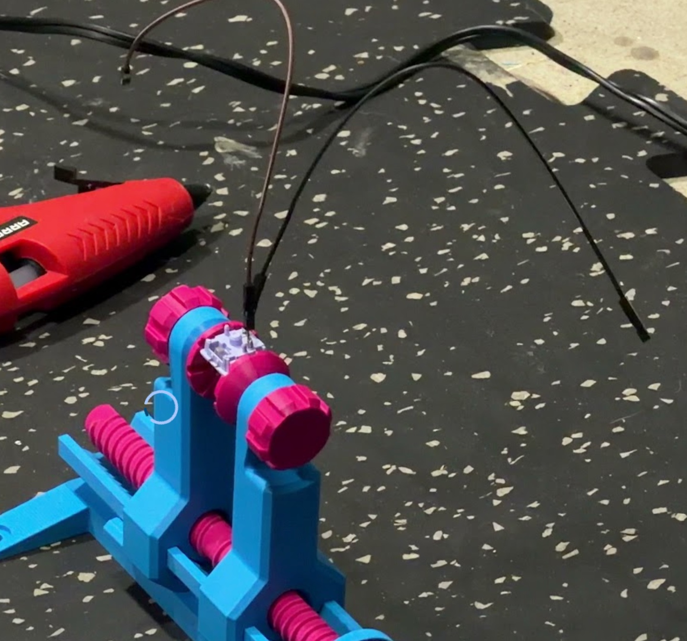
</div>

<div align="center">
  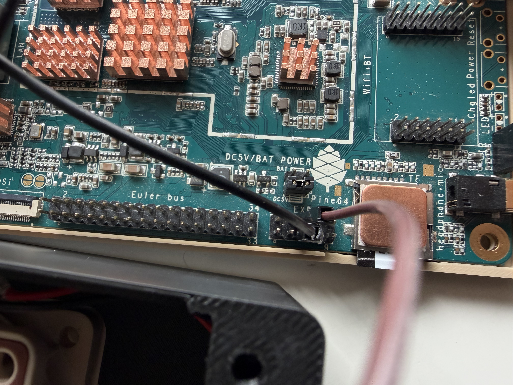
</div>

## Hour 19: Final Case Assembly

* **Date:** June 30, 2026

### Activity Summary
Installed the fan into the printed top enclosure on its three mounting pillars and seated the Pine A64 board into the bottom shell, bringing every subsystem wired in Hours 17–18 into one physical unit for the first time.

### Engineering Notes
* **Fan Seated:** Confirmed the fan sits flush on the three remaining pillars (per the Hour 16 clearance fix) with the airflow arrow oriented onto the board's heatsinks.
* **Fit Check:** Verified all wiring (fan power, power button, USB extension) had enough slack to route cleanly without pinching once the case was closed — cable routing itself was left for Hour 20.

<div align="center">
  
</div>

## Hour 20: Cable Management & Final System Test

* **Date:** June 30, 2026

### Activity Summary
Cleaned up the internal wiring before closing the case for good, then ran the full system test on the completed build.

### Engineering Notes
* **Cable Management:** Hot-glued the fan leads and the MT3608 boost converter directly to the inside of the printed shell. This keeps both from shifting or rattling around loose next to the board, and routes the wiring flush against the wall instead of draped across the heatsinks — a cleaner build and one less thing to catch when the case is opened for maintenance.
* **Full System Test:** Powered on the fully closed unit. The power button reliably starts and shuts down the board on each press, the fan spins up immediately and moves air across all heatsinks, and DietPi boots straight to the Moonlight auto-launch script from Hour 11.
* **Moonlight Verified:** Paired with the host gaming PC and streamed a live session end-to-end through the fully enclosed case — confirming the DRM/KMS pipeline, hardware decode path, and cooling solution all work together under real streaming load, not just on the bare board.

<div align="center">
  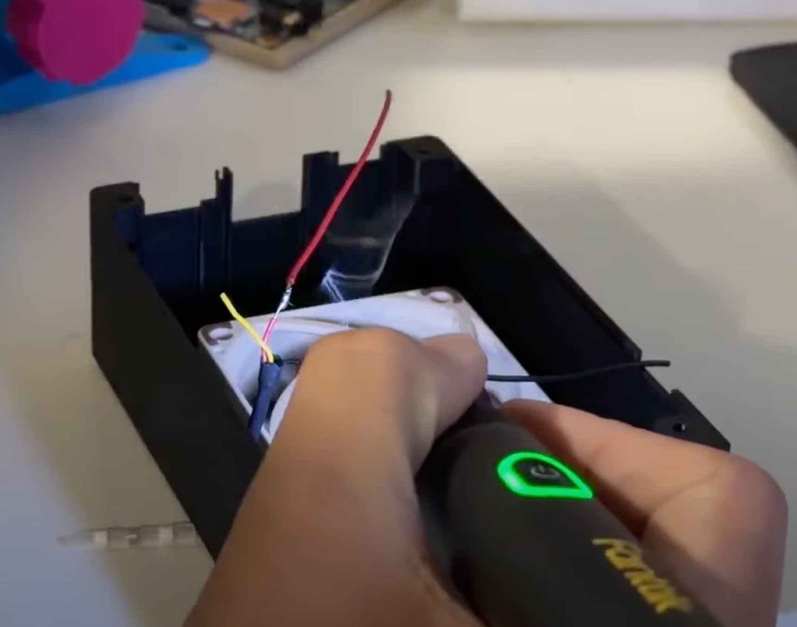
</div>

<div align="center">
  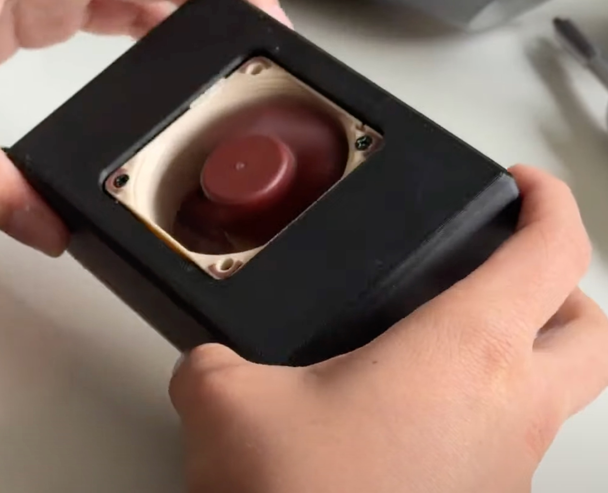
</div>

<div align="center">
  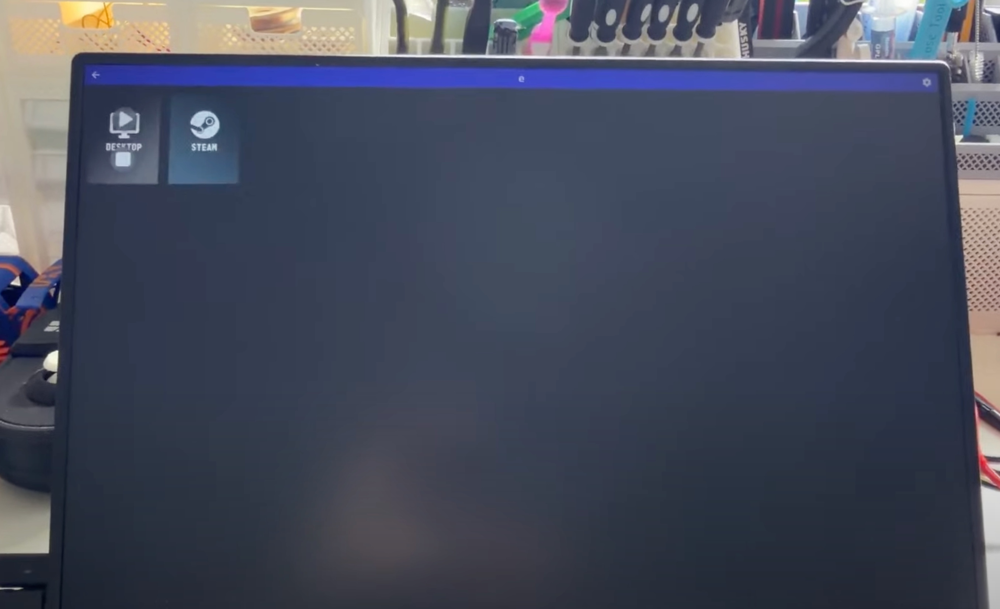
</div>

## Hour 21: Design Source Files & Repository Cleanup

* **Date:** June 30, 2026

### Activity Summary
Per the [Hack Club Horizons hardware shipping guide](https://guides.horizons.hackclub.com/guides/shipping-guide/#-hardware), exported and committed the CAD design source files so the build is fully reproducible, not just documented in photos.

### Engineering Notes
* **Added `/CAD`:** Committed the native Fusion 360 archive (`P64-CASE.f3z`), the sliceable top/bottom STL exports, and the print-ready `.3mf` project file used for the final top-shell print.
* **Why this matters:** The shipping guide flags "photos but no design source" submissions for rejection — the STL/F3Z files let a reviewer (or anyone else) re-slice and reprint the exact enclosure without needing to reverse-engineer it from images.
* **Still open before final submission:** an itemized BOM file and demo video link should still be added to the README per the guide's checklist.
