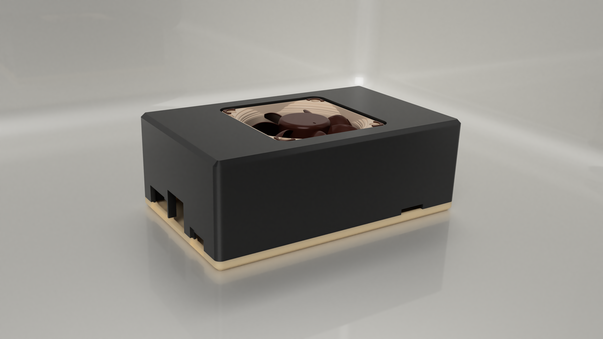
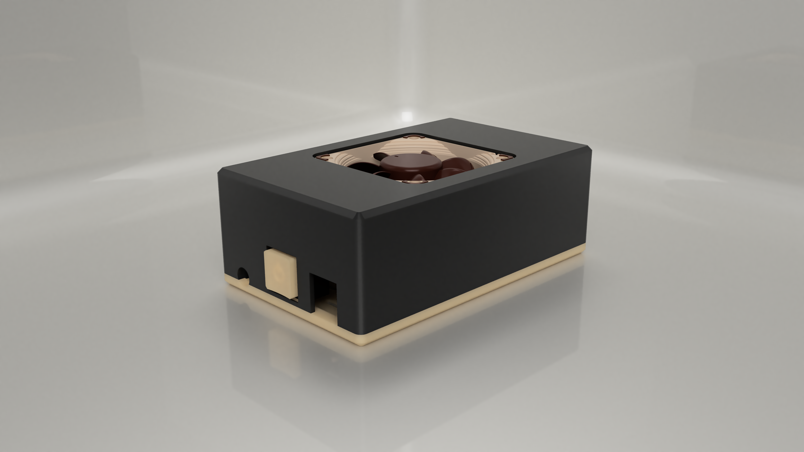
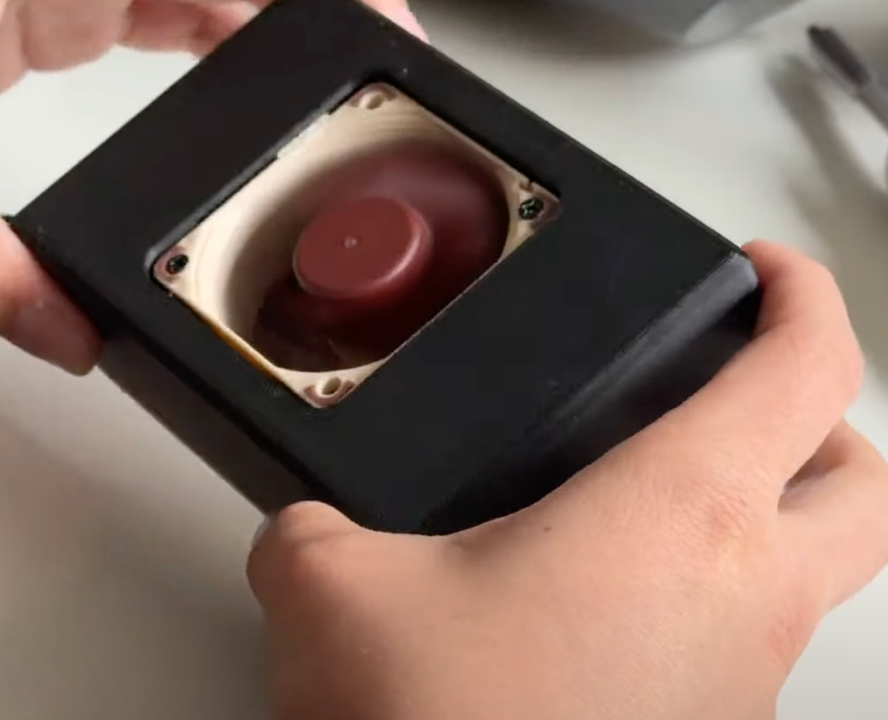
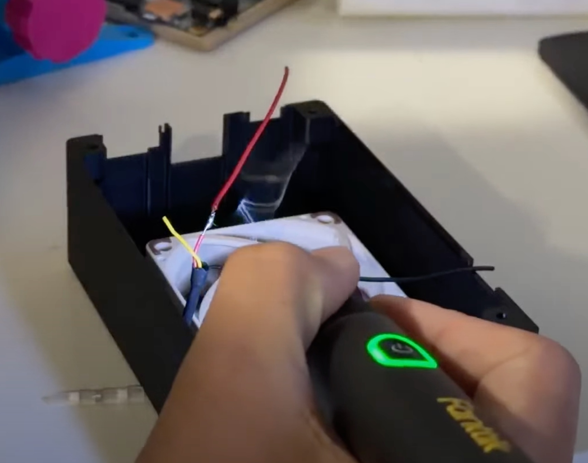
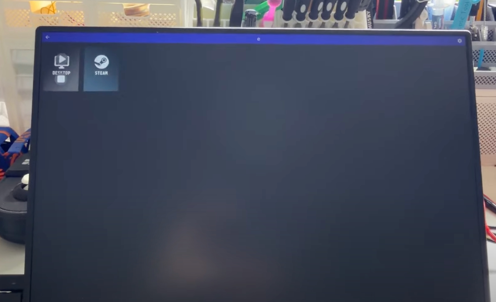

# Pine A64 Gaming PC

<table align="center">
  <tr>
    <td align="center"><b>Digital model (Fusion 360 render)</b></td>
    <td align="center"><b>Digital model (Fusion 360 render)</b></td>
    <td align="center"><b>Physical result</b></td>
  </tr>
  <tr>
    <td></td>
    <td></td>
    <td></td>
  </tr>
</table>

Converting a Pine A64 single-board computer into a fully functional, custom-cooled, custom-enclosed cloud/retro gaming PC. Built for [Hack Club Horizons](https://guides.horizons.hackclub.com/).

The board runs DietPi and streams games from a host gaming PC over [Moonlight](https://moonlight-stream.org/), using hardware-accelerated video decode. Active cooling (Noctua fan + boosted 12V rail) keeps it stable under sustained streaming load, and the whole thing lives in a custom 3D-printed enclosure with a snap-fit power button.

**Demo video:** [Moonlight streaming Roblox and BeamNG.drive](https://photos.app.goo.gl/yZgWkz5E3pNsgPrR7)

**Full build log:** [Devlog.md](./Devlog.md) — 23 hourly entries covering teardown, cooling, OS bring-up, the DRM/KMS graphics debugging saga, CAD design for the enclosure, final wiring, and a custom OpenSCAD keycap.

**Timelapse archive:** [Build session recordings](https://drive.google.com/drive/folders/1OZEimO6eNiohD2dQr07wJ2Tfkh4ZQb1m?usp=sharing)

**Bill of Materials:** [Pine A64 PC Bill of Materials.csv](./Pine%20A64%20PC%20Bill%20of%20Materials.csv) (itemized parts, quantities, unit/total cost, source links)

**Project tracker:** [Google Sheet](https://docs.google.com/spreadsheets/d/1We2MmTOR3fEgsacE6zURNgYWdwFos29sACSzlIPlyxY/edit?usp=sharing)

---

## What's in this repo

```
├── Devlog.md            Hourly engineering devlog (build history, root-cause writeups)
├── CAD/                 Case + keycap design source files (Fusion 360, STL, 3MF)
├── Hardware/            Exported wiring schematic PDF for quick review
├── firmware-config/      DietPi boot config, Moonlight autostart, udev rule, installer
├── Photos/               Build photos referenced from the devlog
└── README.md
```

## Hardware

| Component | Purpose |
|---|---|
| Pine A64 (2GB, Rev B) | Main compute, ARM64, running DietPi |
| Noctua NF-A6x25 FLX (12V, 0.96W) | Active cooling fan |
| MT3608 adjustable boost converter | Steps board's 5V rail up to the fan's supply voltage, isolated from the board's own power |
| Copper heatsinks | Passive cooling on SoC + power stages |
| Cherry MX (DIO-style) switch | External power button |
| Custom 3D-printed enclosure | Top/bottom shell, fan mount, power button cutout (see `/CAD`) |
| Custom OpenSCAD keycap (KeyV2) | Correctly-sized cap for the undersized cutout, engraved with a power icon |

Full itemized costs, quantities, and source links are in [Pine A64 PC Bill of Materials.csv](./Pine%20A64%20PC%20Bill%20of%20Materials.csv).

### Wiring & electrical schematic

This build has two separate voltage rails that must never touch each other: **5 V powers the Pine A64. 12 V powers only the Noctua fan.** The MT3608 boost converter is the only thing that ever sees 12 V; everything on the board side stays at 5 V.

Reviewer-friendly schematic export: [Hardware/wiring-schematic.pdf](./Hardware/wiring-schematic.pdf)

```text
5 V PSU
  ├── PINE A64 power input (microUSB, or Euler pin 2/4 → GND pin 6/9)
  └── MT3608 boost converter input (IN+ / IN-)

MT3608 output, adjusted to 12.0 V
  └── Noctua fan (red = OUT+, black = OUT-, yellow = disconnected/insulated)

Key switch (momentary, normally-open)
  └── EXP header pin 5 (Pwr/Stb Sw) ↔ EXP header pin 6 (GND)
```

**Main board power** — the Pine A64 runs off a regulated 5 V supply, either through its microUSB input or internally via the Euler header's DC-in pins (pin 2 or 4 for +5 V, pin 6 or 9 for GND). Recommended supply: 5 V at 2 A or more.

**Fan power (MT3608)** — the 5 V rail is split so the fan's boost converter draws directly from the PSU rather than through the board, keeping fan startup current off the Pine A64. Before connecting the fan, the MT3608 output is measured with a multimeter and its potentiometer adjusted to 12.0 V. The fan's red/black leads then go to MT3608 OUT+/OUT-; the yellow tachometer wire is left disconnected and insulated (not used in this build).

**Power button (key switch)** — wired to the Pine A64's dedicated **EXP header**, pin 5 (`Pwr/Stb Sw`) and pin 6 (`GND`), *not* in series with the main power line. The switch signals the board to power on/shut down rather than hard-cutting 5 V, which avoids corrupting the microSD card if the OS is running when the switch is pressed.

### PCB / Gerber status

No custom PCB was designed or ordered for this build. The electronics work is point-to-point wiring around the off-the-shelf Pine A64 board, MT3608 boost converter, Noctua fan, and external momentary switch. Because there is no custom board, there are no KiCad/EasyEDA board files or Gerbers to include; the reproducible hardware design artifact is the exported wiring schematic above.

Full pre-power checklist and rationale: [Devlog Hour 23](./Devlog.md#hour-23-ship-ready-wiring-schematic--electrical-safety-review).

## Design source files (`/CAD`)

- `P64-CASE.f3z` — native Fusion 360 archive for the enclosure
- `P64-case-top-v1.4.1.stl` / `P64-case-bottom.stl` — sliceable STL exports
- `P64-case-top-v1.4.1.3mf` — print-ready project file used for the final top-shell print
- `power-button-keycap-v3.stl` — finalized power button keycap, generated with [KeyV2](https://github.com/rsheldiii/keyv2) in OpenSCAD (Hour 22)

### Print settings used

Two printers were used, one per shell, each tuned for what that part needs (surface finish on top, load-bearing strength on the bottom):

| Part | Printer | Filament | Layer height | Infill | Supports |
|---|---|---|---:|---:|---|
| Case top shell | Snapmaker U1 | Bambu PLA Basic (Black), with Bambu Support for PLA | 0.20 mm | 10% gyroid | Normal (snug), dedicated support material |
| Case bottom shell | Anycubic Kobra X | JAYO PLA+ (Wood) | 0.16 mm (high quality) | 15% gyroid | None |
| Power-button keycap | — (either printer) | PLA | 0.12-0.20 mm | 20% | No |

Full context on why each shell uses different settings: [Devlog Hour 24](./Devlog.md#hour-24-finalized-cad-renders-print-settings--assembly-instructions).

## Firmware / software config (`/firmware-config`)

The DietPi boot resolution fix, Moonlight autostart script, and KMS udev permissions rule are committed as real files (not just devlog notes) so the software setup is reviewable and reproducible. See [firmware-config/README.md](./firmware-config/README.md) for what each file does and where it installs.

---

## Build Gallery

<table align="center">
  <tr>
    <td><br/><sub align="center">Fan + board assembly</sub></td>
    <td><br/><sub>Cable management</sub></td>
    <td><br/><sub>Moonlight verified</sub></td>
  </tr>
</table>

More build photos are in [Photos/](./Photos) and referenced throughout [Devlog.md](./Devlog.md).

---

## Steps to Reproduce

### 1. Source the parts

Follow [Pine A64 PC Bill of Materials.csv](./Pine%20A64%20PC%20Bill%20of%20Materials.csv) for the full parts list, quantities, and source links: Pine A64 board, Noctua NF-A6x25 FLX fan, MT3608 boost converter, copper heatsinks, M3 threaded inserts, Cherry MX-compatible momentary switch, USB cable, jumper wires, and 3D printer filament.

### 2. Print the enclosure

Slice and print `CAD/P64-case-top-v1.4.1.3mf` (or the raw STLs) and `CAD/power-button-keycap-v3.stl` using the [print settings above](#print-settings-used):
- **Top case:** Bambu PLA Basic (Black) with Bambu Support for PLA, 0.20 mm layer height, 10% gyroid infill, normal (snug) supports.
- **Bottom case:** JAYO PLA+ (Wood), 0.16 mm (high quality) layer height, 15% gyroid infill, no supports.

Note the fan only clears its mounting pillars with 3 of the original 4 posts installed — see Hour 16 of the devlog if reprinting from the STLs directly.

### 3. Flash DietPi

1. Download [DietPi](https://dietpi.com/) for Allwinner A64 boards.
2. Flash the image to a microSD card using [BalenaEtcher](https://etcher.balena.io/).
3. Before first boot, cold-plug any USB peripherals (keyboard/mouse) rather than hot-plugging — hot-plugging caused brownout resets on this board during bring-up (Hour 3).
4. Boot the board and complete the DietPi first-run setup over SSH (find its IP via your router's DHCP leases, or an ARP/subnet sweep if needed — see Hour 4).

### 4. Apply the boot + graphics config

1. Back up the board's existing DietPi boot environment, then merge in the tracked HDMI cap:
   ```bash
   sudo cp /boot/dietpiEnv.txt /boot/dietpiEnv.txt.backup
   awk '
     /^# PINE_A64_GAMING_PC_BOOT_BEGIN$/ { skip = 1; next }
     /^# PINE_A64_GAMING_PC_BOOT_END$/ { skip = 0; next }
     !skip && $0 !~ /^video=HDMI-A-1:/ { print }
   ' /boot/dietpiEnv.txt | sudo tee /boot/dietpiEnv.txt.tmp >/dev/null
   cat firmware-config/boot/dietpiEnv.txt | sudo tee -a /boot/dietpiEnv.txt.tmp >/dev/null
   sudo mv /boot/dietpiEnv.txt.tmp /boot/dietpiEnv.txt
   ```
   This adds `video=HDMI-A-1:1920x1080@60`, the kernel-level fix from Hour 6. It forces HDMI to 1080p before Linux starts so the Allwinner A64 DRM/KMS stack can initialize without exhausting the CMA memory pool. Keep the backup so you can restore any board-specific DietPi settings if needed.
2. Purge the desktop environment so Moonlight can use the direct DRM/KMS path instead of running through XFCE/LightDM:
   ```bash
   sudo systemctl mask lightdm
   sudo apt purge 'xfce4*' 'lightdm*' -y
   sudo apt autoremove -y
   sudo systemctl set-default multi-user.target
   ```
3. Install the KMS/DRM and input udev rule, then reload udev so the normal DietPi login can access `/dev/dri/*` and `/dev/input/*` devices needed by Moonlight's embedded path:
   ```bash
   sudo cp firmware-config/udev/99-kms.rules /etc/udev/rules.d/99-kms.rules
   sudo udevadm control --reload-rules && sudo udevadm trigger
   ```
4. Verify the DRM/KMS stack is working before moving on:
   ```bash
   modetest
   ```
   This should show the DRM device initializing and the Allwinner display engine recognized (see Hour 10).

### 5. Install Moonlight + autostart

1. Install `moonlight-qt` on the board and pair it with your gaming PC (`moonlight pair <HOSTNAME_OR_IP>`).
2. Append the autostart block to the DietPi user's shell profile — either run the installer:
   ```bash
   cd firmware-config
   chmod +x install.sh
   sudo ./install.sh
   ```
   or manually copy `firmware-config/home/bashrc_moonlight_autostart` into `/home/dietpi/.bashrc`. The installer also performs the boot-environment merge and udev install from Step 4; it is safe to rerun because it removes the previous managed boot block before appending the current one.
3. Edit `/home/dietpi/.bashrc` and replace `<HOSTNAME_OR_IP>` with your actual gaming PC's hostname or LAN IP.
4. Reboot:
   ```bash
   sudo reboot
   ```
   The board should boot straight to a Moonlight session on the main TTY.

### 6. Wire the fan and power button

Follow the [wiring & electrical schematic](#wiring--electrical-schematic) above, in this order:

1. Wire the 5 V PSU to the Pine A64 and, in parallel, to the MT3608 input (IN+/IN-).
2. **Before connecting the fan**, adjust the MT3608 potentiometer while measuring OUT+/OUT- with a multimeter until it reads 12.0 V.
3. Connect the fan's red/black leads to MT3608 OUT+/OUT-. Insulate the yellow tachometer wire — it is not used.
4. Wire the key switch across EXP header pins 5 (`Pwr/Stb Sw`) and 6 (`GND`).
5. Run through the [pre-power checklist](./Devlog.md#hour-23-ship-ready-wiring-schematic--electrical-safety-review) in Devlog Hour 23 before applying power for the first time.
6. Hot-glue the fan leads and the MT3608 to the inside of the shell for strain relief (Hour 20).

### 7. Connect peripherals

Display, network, and input all use the Pine A64's normal external ports: HDMI out to a monitor, Ethernet for lower-latency Moonlight streaming (preferred over Wi-Fi), USB for keyboard/mouse/controller, and the microSD slot for the DietPi boot card.

### 8. Assemble and verify

1. **Install heatsinks first** on the CPU, RAM, SD card slot, and any other chip that generates heat — do this before anything else goes into the case, since it's much harder once the fan and wiring are in the way.
2. **Seat the fan.** Rotate the Noctua fan between the two mounting pillars that have screw holes until it drops into place, with the pillar sandwiched between the top and bottom corners of the fan (Hour 13, Hour 16).
3. **Secure the fan** with 2 M3 screws. If a mounting point is loose, add a drop of super glue to lock it down.
4. **Wire and manage cables** per the [wiring schematic](#wiring--electrical-schematic) — solder the fan, power button, and board connections, then hot-glue everything down for strain relief (Hours 17–20).
5. **Close the case** by screwing in the 4 bottom M3 screws to join the top and bottom shells.
6. Power on and confirm:
   - The power button reliably starts and shuts down the board.
   - The fan spins up immediately, with airflow direction matching the arrow molded into the fan frame.
   - The board boots straight into a Moonlight session.
7. Pair with your host PC and stream a game end-to-end to confirm the full pipeline — see the [demo video](https://photos.app.goo.gl/yZgWkz5E3pNsgPrR7).

## Safety notes

- All wiring in this build is low-voltage DC (5V/12V) — no mains voltage is present anywhere in the enclosure.
- **Never connect the MT3608's 12 V output to the Pine A64.** 12 V is only for the Noctua fan; the board only ever sees 5 V.
- Always verify the MT3608 output with a multimeter (target 12.0 V) *before* connecting the fan for the first time.
- Wire the key switch across the EXP header's `Pwr/Stb Sw` and `GND` pins only — never in series with the main 5 V line. Hard-cutting power while DietPi is running can corrupt the microSD card.
- A hot glue gun and soldering iron are used during assembly; let both cool before handling.
- No lithium batteries are used in this build.

## License

See [LICENSE](./LICENSE).
