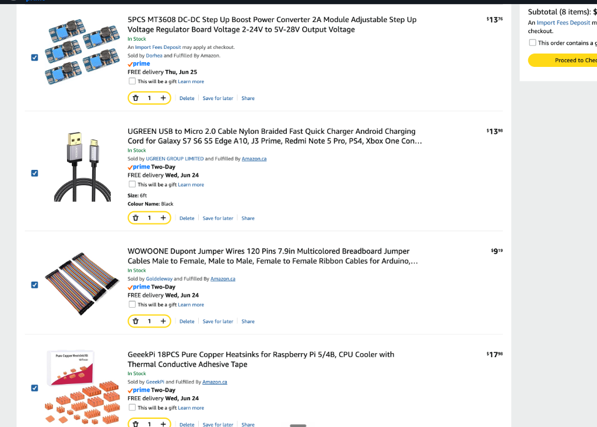
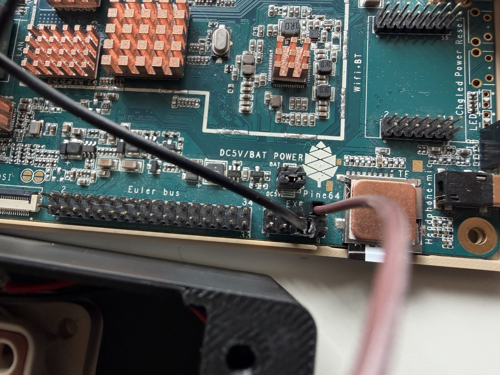
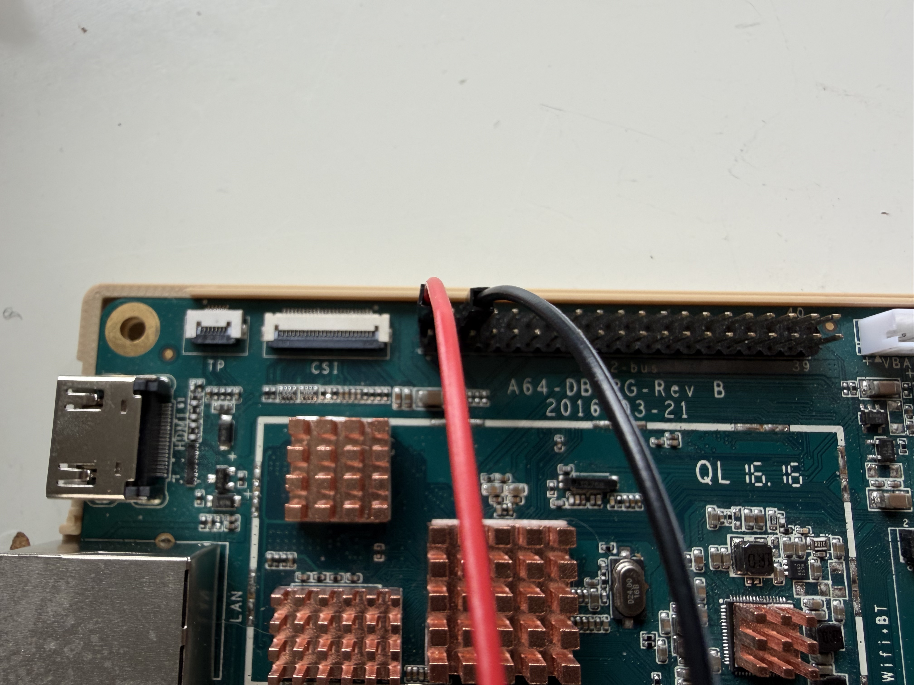

# Pine A64 Gaming PC

  

## Prologue

I got the PINE A64 single-board computer after getting second place at the Equinox hackathon in Vancouver. It originally came in an quite fancy display case made with metal bolts and acrylic. For months, I kept it in its display case on my bookshelf and every time I walked past it, it reminded me that I had a usable computer which I had no plan for.

At the same time, I was using Moonlight to stream games from my main PC because I have a MacBook and I am unable to play some of my favorite games on it; additionally, my room gets too hot during the summer, which with the addition of my PC makes it even hotter. My first idea was to use another normal computer as the receiver, as I have an old Windows laptop lying around, but using a whole computer to stream from another computer felt wasteful and unoriginal. Plus, the laptop's ports were all broken due to a faulty BIOS chip, so I could not connect any peripherals to it. The Pine A64 seemed like a perfect middle ground to my problem: Being small and portable, generating almost no heat due to having a low-powered CPU, and having gigabit ethernet with the addition of a full size HDMI port which I can connect a larger display to.

Back in 2025, around summer, I just set up Moonlight game streaming, which blew me away on how smooth and simple it was. The problem was that I wanted a computer in each of my rooms so I can all connect them to my host PC; therefore, performance would not matter with the added benefits of less heat generation. When I heard about Hack Club Horizons, after winning the PINE A64, I was was finally ready to build it, and I wanted to go to the hackathon, so I submitted it as a Horizons project too with all my hours logged. I came up with the enclosure, created a cooling solution with a spare Noctua fan lying around, power button, software setup, and the rest of the project myself.

## The finished computer

The name "Gaming PC" is a little generous because the Pine A64 is receiving the rendered game from my main PC, not running games locally. I am running DietPi on the microSD card, and along with Moonlight installed, I streamed games over Ethernet. That essentially is all there is on the software side. Physically, I stuck copper heatsinks onto the board, placed a Noctua NF-A6x25 fan above them with the correct voltage control module to output 12V, and then I designed and made a printed case fit around all of it and attached a power button to turn it on and off.

In my final test of the computer, games streamed in 720p with around 20-30 FPS. Fast games such as shooters are not great on it. Slower story games such as driving games are somewhat enjoyable, which surprised me because this is old and slow hardware, and I honestly never expected it to stream games in the first place.

I tried getting hardware video decoding to work and changed a lot of settings, but I kept running into video problems. The finished setup is mainly decoding on the CPU. Its Gigabit Ethernet connection is fine and is definitely not the bottleneck; the video hardware is where it struggles as the CPU is really slow even back in 2016.

Pressing the power button/plugging in the 5V power supply starts the board, and after the first boot checks it goes into Moonlight by itself. I timed about 10 seconds from the press to Moonlight. My button is just a mechanical keyboard switch wired to the Pine A64 power header. It tells the operating system to shut down, rather than yanking the power every time I want the PC to shut down.

The Pine A64 only gets 5V; therefore, I used an MT3608 boost converter to make 12V for the cooling fan, and that 12V output does not draw too much power from the board. The physical power switch was also in the correct orientation during testing. It was not responsible for the crashes that I was experiencing.

[Here is the video of Roblox and BeamNG.drive running on it,](https://photos.app.goo.gl/yZgWkz5E3pNsgPrR7)

  

  

## Steps to Reproduce

If you want to build this Pine A64 Gaming PC yourself (which I don't recommend since you can get way faster hardware in 2026+, such as a Raspberry Pi), you can follow these steps to manufacture the parts, assemble the hardware, flash the software, and test the final build. 

### 1. Prepare
Before assembling, you would need the following components:

1. **Buy these Components:** 
   Source a Pine A64 board (used ones are like free at this point) a Noctua NF-A6x25 FLX 12V DC fan (get the 5V version if possible), an MT3608 boost converter (if voltages are incompatible), a Cherry MX style mechanical switch (does NOT matter which one you get), copper heatsinks (raspberry pi ones work great), a reliable microSD card (the first microSD failed on me since I got it from shady chinese seller), and wiring hardware.

   

     
   

   **You will also need the following**

   - Soldering Iron
   - Multimeter
   - Good quality power brick + microUSB cable
   - 3D printer to print the case and power button
   - Appropriate hardware, such as screws, solder, hot glue gun, etc.
   - Another computer to flash the OS and SSH into the board
   - Monitor
   - Ethernet cable to connect to the network
   - Micro SD card

2. **3D Print the Enclosure:** Use the provided files in the `CAD/` folder.
   * **Top Shell:** Print with 0.20 mm layers and 10% gyroid infill (supports required under the fan cutout). If you have a tool changer 3D printer, I recommend using dedicated support material for easy removal.
   * **Bottom Shell:** Print with 0.16 mm layers and 15% gyroid infill (no supports required).
   
   

     
   

3. **Print the Keycap:** Print the `CAD/power-button-keycap-v3.stl` file for the custom power button keycap, which will fit the case (normal sized keycaps won't fit the cutout).

### 2. Assemble

**Make sure power is disconnected from the Pine A64 before you start assembling**

1. **Install Heatsinks:** Apply the copper heatsinks to the CPU, RAM, and SD card slot before putting anything in the case.
2. **Mount the Fan:** Slide the Noctua fan into the top enclosure and secure it to the internal pillars with M3 screws. Expect to use more force than expected to fit it in. Super gluing the fan onto the pillars is highly recommended since 3D printed inserts might get loose over time.
3. **Wire the Power Switch:** Solder the Cherry MX switch leads to the Pine A64 EXP header (Pin 5 and Pin 6). Snap the switch into the side panel cutout, and after put on the power button keycap.
   
   

     
   

   
4. **Wire the Cooling System:** Connect the MT3608 boost converter input to the Pi-2 Bus header 5V (Pin 2) and GND (Pin 6). **IMPORTANT:** Tune the MT3608 output to exactly 12.0V using a multimeter *before* connecting the fan. You can use a flathead screwdriver to rotate the knob until you get an output of 12V. After, connect the fan's red wire to `OUT+` and black to `OUT-`. do not connect the yellow wire. 
   
   

     
   

   
5. **Final Assembly:** Hot glue the wires and MT3608 to the inside of the printed shell, tidy up the cables, and place the board in the bottom shell and screw the top and bottom pieces together using four M3 screws.

### 3. Flash (software configuration)
Here is the tricky part in my opinion:

1. **Flash OS:** Flash DietPi onto a high-quality microSD card. Low-end ones are unreliable and often are the cause of booting issues (speaking from experience). After, insert the microSD card into the Pine A64 and follow the install instructions.
2. **Configure Display:** Edit `/boot/dietpiEnv.txt` to inject a strict resolution limit (e.g., `video=HDMI-A-1:1920x1080@60`). This frees up memory for the hardware video decoder, so you get more frames in Moonlight.
3. **Remove Desktop:** Uninstall the graphical desktop environment completely so the board boots directly to a bare terminal. This saves memory and prevents the X11 overhead.
4. **Setup Moonlight:** Install Moonlight and configure it to run in embedded mode using the KMSDRM video driver.
5. **Configure Autostart:** Add Moonlight to the root user's `.bashrc` profile with a short `sleep 3` delay to avoid race conditions. Write a udev rule to grant open read/write access to the GPU nodes (`/dev/dri/card0` and `/dev/dri/renderD128`).

### 4. Testing

1. **Pre-Power Safety Check:** Ensure 12V from the boost converter only goes to the fan, and never touches the Pine A64 board. 
2. **Power On:** Supply 5V power to the board via micro USB. The board should power on without pressing the power button.
3. **Verify Cooling:** The Noctua fan should spin up and direct air downwards onto the copper heatsinks.
4. **Verify Boot:** Connect the board to an Ethernet network and an HDMI display. It should boot directly into Moonlight in about 10 seconds. A terminal like startup is normal.
5. **Stream:** Pair Moonlight with your host PC and start a game to verify hardware decoding is functioning properly. You should expect low frame rates since the Pine A64 is weak & old, but it should be playable.
   
   

     
   

   
6. **Test Power Button:** Long press the power button, and you should see the Pine A64 shut down within a few seconds. Short press and it will turn on again.

## Build files and proof
Here are all the relevant build files if you are checking out this project or if you want to replicate it for yourself.

- [24-hour devlog](./Devlog.md) - everything that happened in the 24 hours the project took
- [CAD folder](./CAD) - all the CAD files, such as Fusion and 3D printing files\*
- [wiring PDF](./Hardware/wiring-schematic.pdf) - wiring diagram
- [DietPi and Moonlight configuration](./firmware-config) - OS and software configuration
- [parts and prices](./Pine%20A64%20PC%20Bill%20of%20Materials.csv) - parts and prices
- [recorded build sessions timelapses](https://drive.google.com/drive/folders/1OZEimO6eNiohD2dQr07wJ2Tfkh4ZQb1m?usp=sharing) - recorded build sessions timelapses
- [project spreadsheet](https://docs.google.com/spreadsheets/d/1We2MmTOR3fEgsacE6zURNgYWdwFos29sACSzlIPlyxY/edit?usp=sharing) - project spreadsheet

\* The editable enclosure is `CAD/P64-CASE.f3z`. I included the top and bottom STL files, the 3MF I printed, and the custom power-button keycap. The top shell was printed on a Snapmaker U1 with black Bambu PLA Basic at 0.20 mm layer height and 10% gyroid infill. The bottom came from an Anycubic Kobra X using wood JAYO PLA+ at 0.16 mm and 15% gyroid infill.

There is no custom PCB in this project. The wiring is point to point, so the PDF schematic is the hardware design file instead of a Gerber archive. The firmware folder has the installer and the exact boot, udev, and Moonlight startup files I used. I left the longer setup commands beside those files because that is where I would look for them if I were rebuilding it.

## Epilogue

If I was able to restart this project, I would start with a brand new, more reliable microSD card. I realized mine was dying much too late, after I had already spent hours blaming the operating system.

I would also be more careful with sources. This board is old enough that there is barely any current documentation for some of its problems. I used Google's AI search while debugging and the AI answers hallucinated details about the board, which sent me into more errors. Now I would check those answers against the board documentation and the official wiki before changing system files that I didn't know about.

After finishing this project, I can now install DietPi/linux on a single-board computer, set up a machine without a desktop, work through it using SSH, and make Moonlight start automatically. In 2026, this board is slow, but it is not useless. That was the entire point of the project: proving that old hardware doesn't automatically mean obselete hardware, just like how the corporate overlords want us to think.

## AI use

I used AI as a tool for researching about this board, finding answers to my questions/debugging. I also used some AI to assist me with organizing my ideas/thoughts together for the devlog, but all the writing is my own doing.

I did the CAD work, printing decisions, soldering, wiring, assembly, Linux installation, and physical debugging.

## License

[MIT License](./LICENSE)
